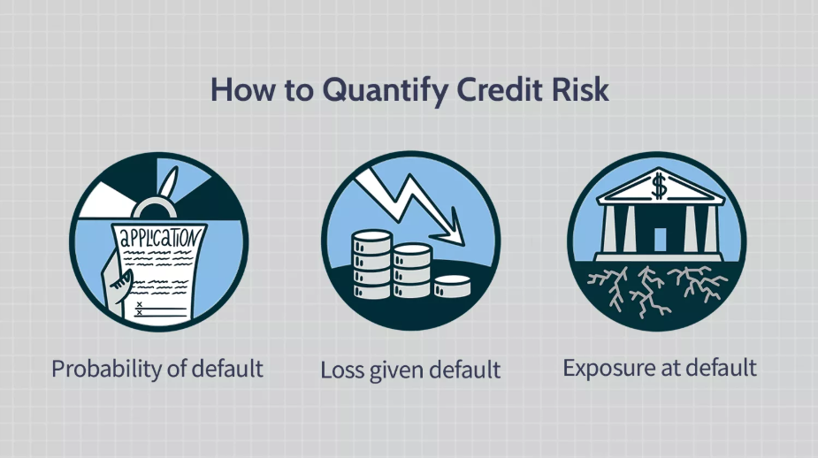

 

## Project Introduction

This project aims to develop models for predicting Expected Credit Loss (ECL) for loans on the Lending Club platform. By analyzing important factors like Probability of Default (PD), Exposure at Default (EAD), and Loss Given Default (LGD), the models will provide insights that inform credit risk management strategies.

## Table of Contents

- [References to Analysis](#references-to-analysis)
- [Project Overview](#project-overview)
- [Goal of the Analysis](#goal-of-the-analysis)
- [Limitations](#limitations)
- [Dataset Overview](#dataset-overview)
- [Project Organization](#project-organization)
- [Project Flowchart](#project-flowchart)
- [Credits & References](#credits--references)

## References to Analysis

For those who wish to deepen their understanding of the processes and findings in Exploratory Data Analysis, Modeling, and Evaluation, please refer to the links below for direct access to Jupyter Notebooks
1. [notebook1_data_import_cleaning_target_creation](notebooks/notebook1_data_import_cleaning_target_creation.ipynb)
2. [notebook2_EDA](notebooks/notebook2_EDA.ipynb)
3. [notebook3_pd_model](notebooks/notebook3_pd_model.ipynb)
4. [notebook4_lgd_model](notebooks/notebook4_lgd_model.ipynb)

## Project Overview

### Why Banks Need to Predict Expected Credit Loss (ECL)

Banks and lending institutions face the fundamental challenge of managing credit risk to ensure financial stability, regulatory compliance, and profitability. Accurate prediction of **Expected Credit Loss (ECL)** is essential because it provides a forward-looking estimate of potential losses from the loan portfolio. This estimation helps:
- Allocate sufficient capital reserves to cover anticipated losses.
- Price loans appropriately, balancing profitability with risk mitigation.
- Comply with regulatory standards such as IFRS 9 and Basel III, which require recognition of expected losses based on current and forecasted information.
- Establish and adjust credit policies to accommodate evolving borrower behavior and economic conditions.
- Monitor portfolio health continuously and adopt proactive risk management strategies to prevent unexpected losses.

### Definitions for Expected Credit Loss (ECL)

1. **Expected Credit Loss (ECL)**  
   ECL is the primary metric for credit provisioning under accounting standards like IFRS 9. It represents the expected loss on a financial asset over a specific time horizon.  
   $$\text{ECL} = \text{PD} \times \text{LGD} \times \text{EAD}$$

2. **Probability of Default (PD)**  
   PD is the likelihood that a borrower will default over a particular period.  
   Formula: $$\text{PD} = \frac{\text{Number of Defaults}}{\text{Total Loans on the Book}}$$ 
   Modeled using Logistic Regression or machine learning techniques with a binary outcome.

3. **Loss Given Default (LGD)**  
   LGD measures the severity of loss expected, expressed as a percentage of exposure, assuming default occurs.  
   Formula: $$\text{LGD} = 1 - \text{Recovery Rate (RR)} = 1 - \frac{\text{Total Recoveries (Net of Costs)}}{\text{Exposure at Default (EAD)}}$$
   Modeled using regression techniques such as Beta Regression.

4. **Exposure At Default (EAD)**  
   EAD is the total amount the bank is exposed to at the default event.  
   Formula: $$\text{EAD} = \text{Drawn Amount} + (\text{Undrawn Commitment} \times \text{CCF})$$
   CCF modeling is not the focus of this project due to difficulty in obtaining relevant data.

## Goal of the Analysis

The primary objective is to mimic how credit risk modelers at financial institutions develop models—specifically, models for **Probability of Default (PD)**, **Loss Given Default (LGD)**, and Exposure at Default (EAD)—to predict **Expected Loss (ECL)**.

## Limitations

1. **Static Nature of Prediction**: The models are based on a snapshot prediction at loan issuance, lacking dynamic tracking of risk.
2. **Simplified Exposure at Default (EAD)**: The project does not model CCF for revolving credit lines due to lack of relevant data, and EAD calculation is simply assumed to be the outstanding principle.

## Dataset Overview

The dataset used in this analysis is from Lending Club, a prominent peer-to-peer lending platform. It includes loan-level details such as:
- Loan information: status, amount, terms, interest rate, purpose
- Borrower characteristics: borrower_id, grade (credit score), income, employment length, zipcode, address state
- Performance variables: payment status, utstanding balance, revolving balance, previous history of delinquencies, total number of accounts, number of loan inquiries in the past 6 month
- Derived features: loan_age, utilization rate, debt-to-income ratio

## Project Organization

**Repository :** 
* `data` 
    - saved copy of raw and processed data as long as those are not too large 
    - data dictionary

* `model`
    - `joblib` dump of model(s)

* `notebooks`
    - contains all final notebooks involved in the project

* `src`
    - Contains the project source code (refactored from the notebooks)

* `.gitignore`
    - Part of Git, includes files and folders to be ignored by Git version control

* `environment.yml`
    - Conda environment specification

* `README.md`
    - Project landing page (this page)

* `LICENSE`
    - Project license

## Project Flowchart

This project is divided into five main steps:
### 1. Data Cleaning
- Tasks performed include sorting the dataframe, removing irrelevant features, treating missing values, converting data types, and creating target variables for PD and LGD modeling.

### 2. Exploratory Data Analysis
- Perform univariate analysis to investigate distributions of targets and predictors and how PD and LGD change over time.
- Identify variables with outliers and seek solutions to address them.
- Analyze patterns among missing values and determine methods for imputation.
- Conduct multivariate analysis to assess the correlation between targets and predictors.

### 3. Preprocessing and Feature Engineering
- Remove irrelevant and leaky predictors from the training data.
- Address outliers and missing values comprehensively.
- Apply feature engineering based on insights derived from EDA.

### 4. PD Modeling
- Use Logistic Regression to model the likelihood of borrower default, generating the probability of default (PD) for the entire portfolio. Evaluate and interpret the model, fixing any identified issues.

### 5. LGD Modeling
- Use a two-step approach with classification and regression to model recovery rates (RR) and use the formula to derive Loss Given Default (LGD). Evaluate and interpret the model, adjusting as necessary.

 

## Credits & References
 [Credit Loss Modeling (PD/LGD/EAD)](https://www.youtube.com/watch?v=q4TaJHmu788&list=PLn699ZSeIUYeev-Fwyt-NLf7e5yKnY28q&index=8)